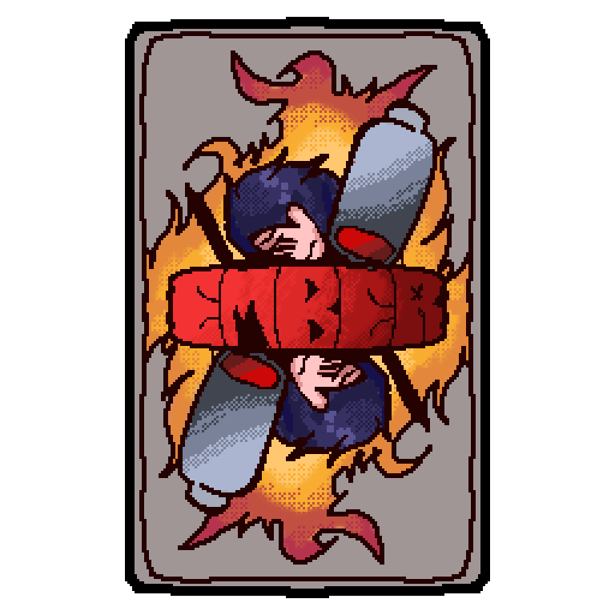
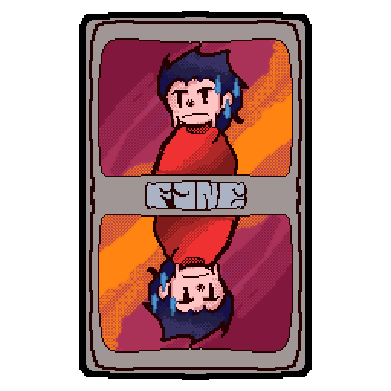
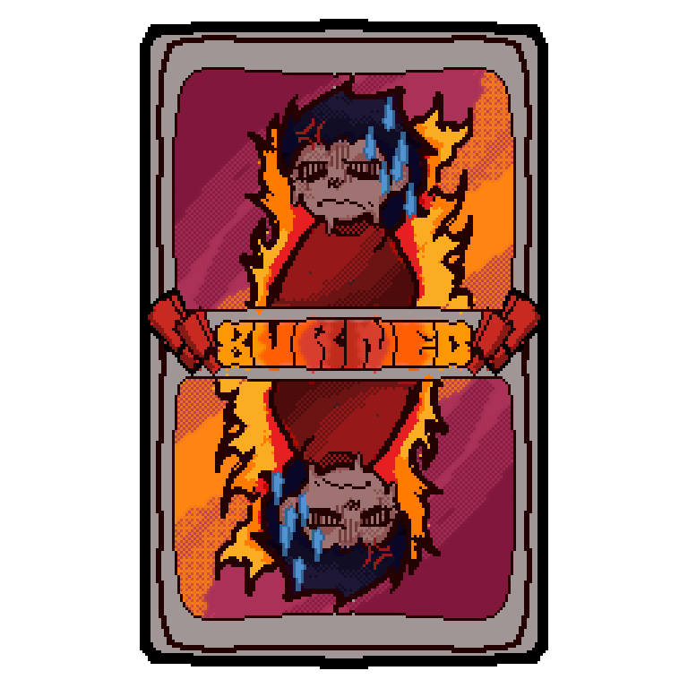

# Ember Burnout: Scenario Evaluator

Ember Burnout is an interactive, scenario-based tool designed to evaluate and categorize stages of occupational burnout. 

**🔗 [Play the Live Demo Here](https://ember-burnout.netlify.app/)**

##  Visual Design & Hand-Drawn Assets
A core focus of this project is the visual aesthetic. All character concepts, UI elements, and scenarios were illustrated entirely by hand.

##  How It Works
The tool presents users with specific workplace scenarios and uses logic-based categorization to determine their current level of burnout. 
* **Scenario Evaluation:** Processes user responses through tailored situational queries.
* **Stage Categorization:** Maps answers to standardized burnout stages.

##  Technology Stack
* **Core Logic:** Scenario-based state evaluation.
* **Visuals:** Traditional hand-drawn illustration.
